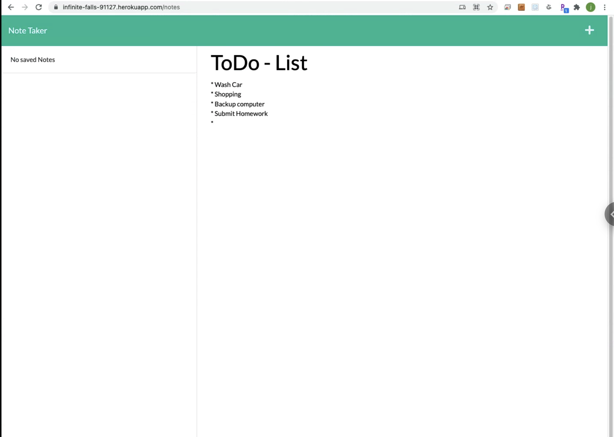
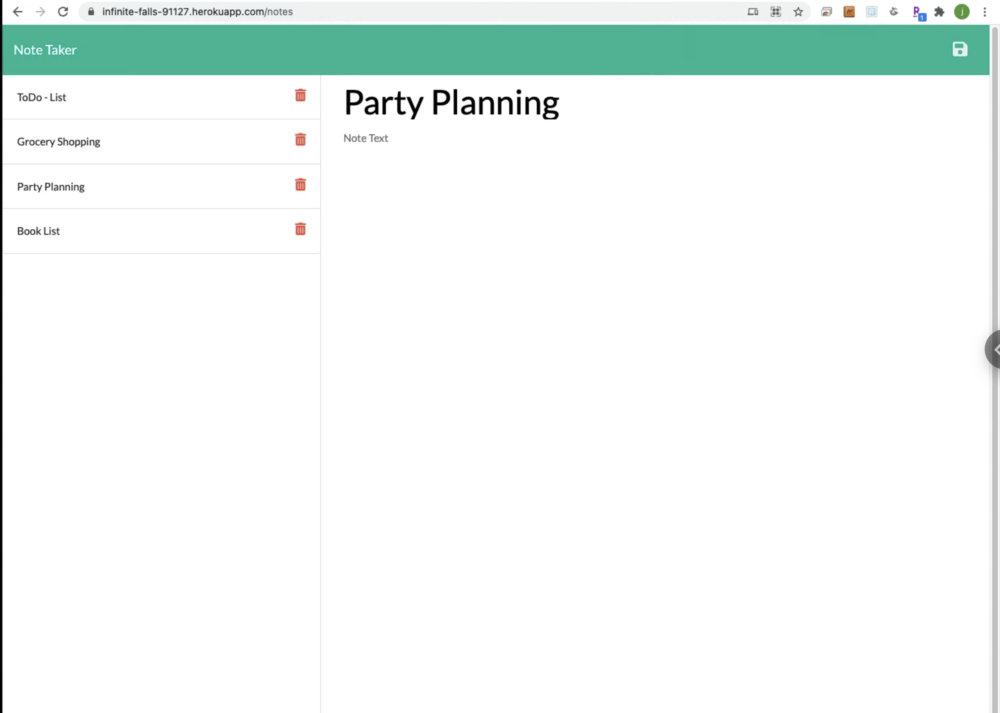
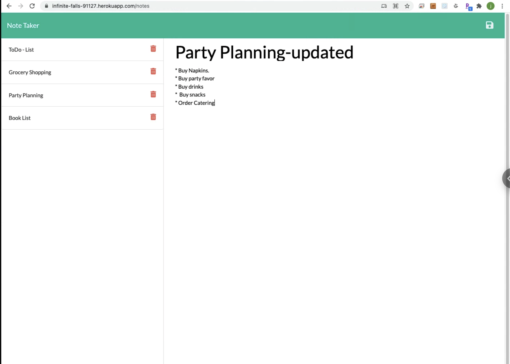

# express-note-keeper 

 
# Description 

 A node.js express project deployed to heroku. The project is a note taking app with a web interfacee. 

 

 ## Table of Contents 

  * [Installation](#installation)
  * [Usage](#usage)
  * [Credits](#credits)
  * [Links](#links)
  * [Contributing](#contributing)
  * [License](#license) 
# Installation 
 npm i  
# Usage 
 node server.js 
 # Credits 
 * Heroku 
 * Node.js 
 * Express 
 * UUID  

# Links
 <ul><li><a href="https://github.com/mogannam/express-note-keeper.git">Code on GitHub</a> </li>
  <li><a href="https://infinite-falls-91127.herokuapp.com/notes">Demo of Deployed Project</a></li>
  <li>Clone the projecct here: git@github.com:mogannam/express-note-keeper.git </li></ul> 

 
  
# Contributing 
 express-note-keeper has adopted the [Contributor Covenant](https://img.shields.io/badge/Contributor%20Covenant-2.1-4baaaa.svg) code of conduct, for contributions. 

 # License 
 express-note-keeper is [MIT](https://opensource.org/licenses/MIT) Licensed. 
